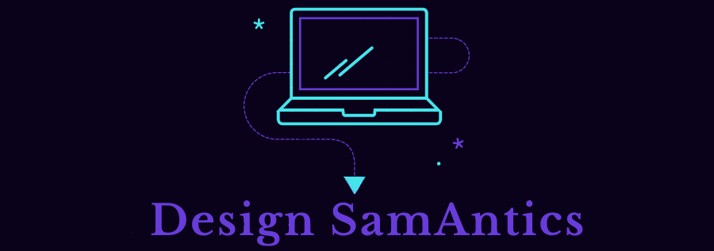

<h2 align="center" style="color:rgb(60, 70, 186)">Hi, there!  Welcome to my development playground. 🛝</h2> 

- 🔭 I’m currently working on ... getting myself employer ready. 
- 🌱 I’m currently learning ... to further hone all the skills I've recently learned at the UTSA Web Development Bootcamp 
- ⚡ Fun fact: ... I used to be front woman in a band called Simplicity Myth.

 

<b> About Me</b>

I am a new developer, having recently earned a certificate through UTSA's 24-week web bootcamp. Before deciding to pivot wildly into programming, I have been a freelance writer and editor, as well as have 20-plus years experience in customer service.
 

 
 

<h2 style="color:rgb(156, 215, 240)">🛠️ Tools and Languages</h2>

                      
  

<h2 align="center" style="color:rgb(60, 70, 186)">📨 How to Contact Me</h2>

 

  

<h2 style="color:rgb(91, 192, 199)">🖥️ My Recent Work</h2>

 &nbsp; 

